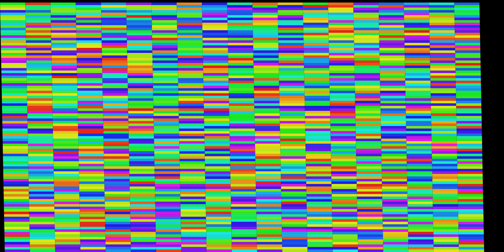

## Background

Genome browsers commonly stack features that occupy genomic ranges on top of
each other sort of like bricks. There are likely other possible applications.
These stackings don't need to be the NP-hard bin-packed optimal layout, just
good enough. It is a little tricky to get the right algorithm to do this
however.

In this repo, I have surveyed a couple of techniques, and put them in a little
benchmark

## Techniques

Some of these are implemented for experimental purposes

### End-array layout

An "end-array" is an idea implemented in gw genome browser
https://www.biorxiv.org/content/10.1101/2024.07.26.605272v3

It uses a single array, with each element of the array representing a row, and
the value of each element of the array keeps track of the current maximum 'end
coordinate' of a feature on that row.

To add a new rectangle to the end-array layout, it iterates over the end-array
array for the first place where the START position of a genomic feature is
greater than a position in the end-array. The first place where the start
position is greater than an element of the end-array means the feature can be
safely 'laid out' there, and the value of that element of the end-array is
updated to the END position of that genomic feature

This layout method works best when incoming features are sorted by their start
position, otherwise the layout will not have good density

### Priority queue layout

This is very similar to the end-array layout, but instead of scanning the
end-array linearly, it has a priority queue that keeps track of the first
available position

This is flatqueue in benchmark and is used by
[GenomeSpy](https://genomespy.app/), developed by Kari Lavikka

### Granular rect layout (w/ "bitmap" layout)

The "Granular rect layout" is a system used in JBrowse 1.

It works with each row being an array of binary true/false, where true
represents the occupied space

It uses a scaling factor when you are "zoomed out" so that it doesn't represent
1 array element per 1bp but rather e.g. 1 array element per 100bp when you are
zoomed out (in the code, it calls this scaling factor the "pitchX")

To add a new rectangle to the layout, it looks at each row, finds if it is
occupied anywhere in the region you want to place the rect, and if it is
occupied there, it checks the next row, and so on

This layout method does not require any particular sorting, though sorting may
increase the density of the resulting layout

### Granular rect layout (w/ interval array)

In 2025, I had Claude Code make some optimizations to make the Granular rect
layout more interval-tree-like, but instead is now an "interval array". So
instead of a bitmap, it just stores an array of intervals in each row. It uses
splice to insert intervals into sorted order. This has a slightly higher upfront
cost, but it is faster to query than the interval tree

This is now used in JBrowse 2 (gran_ultra) in benchmark

### Interval tree

Interval tree is an interesting data structure that lets you query intervals,
and we can imagine each row with its own interval tree to query the occupancy of
a given genomic range. It is O(log(n)) for "queries".

This implementation I used is similar to the granular rect layout but instead of
an array-per-row, it is a interval-tree-per-row

This layout method does not require any particular sorting, though sorting may
increase the density of the resulting layout

## Rendered images

I created rendered images of the resulting layouts in img folder, example



## Benchmark output

#### Wide layout

```

==========================================
Benchmarking with 100,000 rectangles
==========================================
Benchmark 1: node dist/bench/arrsimple.js 100000
  Time (mean ± σ):     33.752 s ±  3.884 s    [User: 33.727 s, System: 0.190 s]
  Range (min … max):   30.083 s … 38.990 s    4 runs

Benchmark 2: node dist/bench/endarr.js 100000
  Time (mean ± σ):      4.379 s ±  0.284 s    [User: 4.230 s, System: 0.249 s]
  Range (min … max):    4.149 s …  4.767 s    4 runs

Benchmark 3: node dist/bench/flatqueue.js 100000
  Time (mean ± σ):      3.820 s ±  0.187 s    [User: 3.700 s, System: 0.226 s]
  Range (min … max):    3.692 s …  4.098 s    4 runs

Benchmark 4: node dist/bench/gran.js 100000
  Time (mean ± σ):     12.990 s ±  0.833 s    [User: 14.691 s, System: 1.026 s]
  Range (min … max):   11.894 s … 13.849 s    4 runs

Benchmark 5: node dist/bench/gran_ultra.js 100000
  Time (mean ± σ):      8.856 s ±  0.835 s    [User: 8.829 s, System: 0.186 s]
  Range (min … max):    7.954 s …  9.975 s    4 runs

Benchmark 6: node dist/bench/iv1.js 100000
  Time (mean ± σ):     49.071 s ±  2.475 s    [User: 49.697 s, System: 0.317 s]
  Range (min … max):   46.568 s … 51.414 s    4 runs

Summary
  node dist/bench/flatqueue.js 100000 ran
    1.15 ± 0.09 times faster than node dist/bench/endarr.js 100000
    2.32 ± 0.25 times faster than node dist/bench/gran_ultra.js 100000
    3.40 ± 0.27 times faster than node dist/bench/gran.js 100000
    8.83 ± 1.10 times faster than node dist/bench/arrsimple.js 100000
   12.84 ± 0.90 times faster than node dist/bench/iv1.js 100000
Done in 454.34s.
```

#### Tall layout

```


==========================================
Benchmarking TALL screen (5000x20000) with 50,000 rectangles
Testing: arrsimple_tall endarr_tall flatqueue_tall gran_tall gran_ultra_tall iv1_tall
==========================================
Benchmark 1: node src/bench/arrsimple_tall.ts
  Time (mean ± σ):      6.682 s ±  0.813 s    [User: 6.657 s, System: 0.177 s]
  Range (min … max):    6.113 s …  7.889 s    4 runs

Benchmark 2: node src/bench/endarr_tall.ts
  Time (mean ± σ):      4.516 s ±  0.474 s    [User: 4.399 s, System: 0.234 s]
  Range (min … max):    4.014 s …  5.060 s    4 runs

Benchmark 3: node src/bench/flatqueue_tall.ts
  Time (mean ± σ):      3.755 s ±  0.106 s    [User: 3.613 s, System: 0.269 s]
  Range (min … max):    3.673 s …  3.898 s    4 runs

Benchmark 4: node src/bench/gran_tall.ts
  Time (mean ± σ):     10.399 s ±  1.161 s    [User: 11.889 s, System: 0.523 s]
  Range (min … max):    9.065 s … 11.896 s    4 runs

Benchmark 5: node src/bench/gran_ultra_tall.ts
  Time (mean ± σ):      7.326 s ±  0.366 s    [User: 7.310 s, System: 0.169 s]
  Range (min … max):    7.028 s …  7.799 s    4 runs

Benchmark 6: node src/bench/iv1_tall.ts
  Time (mean ± σ):     17.797 s ±  3.601 s    [User: 17.958 s, System: 0.234 s]
  Range (min … max):   13.809 s … 21.969 s    4 runs

Summary
  node src/bench/flatqueue_tall.ts ran
    1.20 ± 0.13 times faster than node src/bench/endarr_tall.ts
    1.78 ± 0.22 times faster than node src/bench/arrsimple_tall.ts
    1.95 ± 0.11 times faster than node src/bench/gran_ultra_tall.ts
    2.77 ± 0.32 times faster than node src/bench/gran_tall.ts
    4.74 ± 0.97 times faster than node src/bench/iv1_tall.ts
```

## Next steps

- Experiment with freeing layout memory when no longer used. How this is done
  may vary based on the approach
- See if there are other references to algorithms like this from outside the
  bioinformatics-sphere (masonry layout in CSS?)

## Note

Feel free to provide any optimizations or PRs to this benchmark!
